# タスク・メモ管理PWA 要件定義・基本設計・インフラ設計

## 1. 文書情報

| 項目       | 内容                                             |
| ---------- | ------------------------------------------------ |
| 文書目的   | 実装、テスト、デプロイ、運用の判断基準を定義する |
| 対象アプリ | 個人用タスク・メモ管理PWA                        |
| 本番URL    | `https://memo.isksss.dev`                        |
| 対象読者   | 開発者、テスター、Cloudflare管理者               |
| データ配置 | 利用者のブラウザ内のみ                           |

## 2. 目的とスコープ

### 2.1 目的

タスクとMarkdownメモを単一のPWAで管理し、ネットワーク接続がない状態でも参照・更新できるようにする。利用者データは外部サーバーへ送信せず、端末内のPGliteへ永続化する。

### 2.2 対象範囲

- タスク、親子タスク、繰り返し、通知、タグ、画像の管理
- Markdownメモ、ピン留め、タスクとの任意関連付け
- 一覧、カンバン、月間カレンダー、横断検索
- ゴミ箱、JSONバックアップ、復元
- PWAインストール、オフライン動作、更新通知
- Cloudflare Workers Static Assetsによる配信
- GitHub ActionsによるPRプレビューと本番デプロイ
- Cloudflare AccessによるPRプレビュー保護

### 2.3 対象外

- 利用者アカウント、ログイン、複数利用者、共同編集
- 端末間同期、クラウドバックアップ、サーバーAPI、外部DB
- D1、KV、R2への利用者データ保存
- タスク・メモの公開共有
- 任意ファイル添付
- PWA終了中における通知時刻の保証
- Chrome/Edge以外の正式サポート

## 3. 技術要件

| 分類           | 採用技術・方針                                          |
| -------------- | ------------------------------------------------------- |
| パッケージ管理 | pnpm。バージョンを`packageManager`で固定する            |
| 実行・CI環境   | Node.js 24                                              |
| フレームワーク | Nuxt 4、`ssr: false`のクライアント専用構成              |
| UI             | Nuxt UI 4、ルートを`UApp`でラップする                   |
| CSS            | Tailwind CSS 4。Nuxt UIのセマンティックカラーを使用する |
| DB             | PGlite。`idb://pwa-memo`でIndexedDBへ永続化する         |
| ORM            | Drizzle ORM。Prismaは使用しない                         |
| PWA            | Web App Manifest、Service Worker、Cache Storage         |
| 配信           | Cloudflare Workers Static Assets                        |
| CI/CD          | GitHub Actions、Wrangler                                |
| 言語           | TypeScript、Vue SFC、日本語UI                           |

アプリケーションは静的成果物として生成する。Cloudflare Workerは静的配信、Preview Access JWTの防御的検証、レスポンスヘッダー付与のみを担当し、利用者データを処理しない。

## 4. 利用者と利用環境

- 1端末内の単一利用者を想定し、アプリ内認証は設けない。
- 正式対応は最新安定版Chrome/EdgeのPCおよびAndroidとする。
- 画面幅320px以上のモバイルと、1280px以上のPCを主要レイアウト基準とする。
- 日時は端末のローカルタイムゾーンで表示・入力する。
- 瞬間を表す日時はUTCで保存し、日付のみの値は`YYYY-MM-DD`として保存する。
- 端末のタイムゾーン変更後も、期限・開始日時は同じ現地時刻を維持する。

## 5. 機能要件

### 5.1 初期化

- 初回起動時にPGlite、スキーマ、索引、既定設定を初期化する。
- 2回目以降は未適用マイグレーションを番号順に1トランザクションずつ適用する。
- 初期化中は操作を受け付けず、進捗を表示する。
- 初期化失敗時は再試行、診断情報のコピー、バックアップからの復元を提示する。
- 起動時に30日を超えたゴミ箱データを完全削除する。

### 5.2 タスク

#### 5.2.1 項目

| 項目     | 必須 | 制約                                      |
| -------- | ---- | ----------------------------------------- |
| タイトル | 必須 | 前後空白除去後1～200文字                  |
| 説明     | 任意 | Markdown、最大100,000文字                 |
| 状態     | 必須 | 未着手、対応予定、進行中、保留、完了      |
| 優先度   | 任意 | 低、中、高、緊急                          |
| 開始日時 | 任意 | 端末ローカル日時                          |
| 期限日時 | 任意 | 開始日時以降                              |
| 見積時間 | 任意 | 0～5,256,000分の整数                      |
| 実績時間 | 任意 | 0～5,256,000分の整数                      |
| 親タスク | 任意 | 削除されていないルートタスクのみ          |
| タグ     | 任意 | 重複なし、件数上限50                      |
| 繰り返し | 任意 | 日、週、月、年                            |
| 通知     | 任意 | 期限時、5分前、1時間前、1日前から複数選択 |
| 画像     | 任意 | 最大10枚                                  |

#### 5.2.2 状態と親子関係

- 初期状態は「未着手」とする。
- カンバンで状態列を移動した時点で保存する。
- 親子は1階層までとし、子タスクは親になれない。
- 自分自身または子孫を親に指定できない。
- 親子の状態は独立し、親の完了で子を完了させない。
- 親をゴミ箱へ移す場合、子も同じ操作内でゴミ箱へ移す。復元時も一括復元する。

#### 5.2.3 繰り返し

- 周期は日、週、月、年を選択でき、間隔は1以上の整数とする。
- 週次は複数曜日、月次は月内日または月末、年次は月日を指定できる。
- 繰り返しタスクを完了へ変更した時だけ次回タスクを1件生成する。
- 元タスクの開始日時または期限日時を予定基準とし、完了日を基準にしない。
- 算出結果が過去の場合は周期を進め、現在より後の最初の予定を採用する。
- 月内日が存在しない月はその月の末日とする。
- 次回タスクはタイトル、説明、優先度、見積時間、タグ、繰り返し、通知、親IDを継承し、実績時間と完了日時は初期化する。
- 同じ元タスクの同じ予定回を複数生成しないよう、一意な系列IDと予定日時で制約する。

### 5.3 タスク表示

#### 一覧

- タイトル、状態、優先度、開始日、期限、タグ、親子、更新日時を表示する。
- 状態、優先度、期限範囲、タグ、親子、期限超過の複合絞り込みを提供する。
- 更新日時、作成日時、期限、開始日、優先度、タイトルで昇順・降順に並べ替えられる。
- カーソルページングを使用し、1回の取得上限を100件とする。
- PCは表、モバイルはカード一覧で表示する。

#### カンバン

- 5状態を列として表示する。
- ドラッグ操作とキーボード操作の両方で状態を変更できる。
- 各列は個別に追加読み込みし、DOMは仮想化する。
- 親子関係はカード上の表示に留め、階層ドラッグは行わない。

#### カレンダー

- 月間表示を基本とし、開始日と期限日を表示する。
- 日付選択で該当タスク一覧、タスク選択で詳細を開く。
- ドラッグによる日付変更は、確認後に保存する。
- 繰り返しは実体化済みのタスクだけを表示する。

### 5.4 メモ

| 項目       | 必須 | 制約                        |
| ---------- | ---- | --------------------------- |
| タイトル   | 必須 | 前後空白除去後1～200文字    |
| 本文       | 任意 | Markdown、最大1,000,000文字 |
| ピン留め   | 必須 | 初期値false                 |
| 関連タスク | 任意 | 削除されていないタスク1件   |
| タグ       | 任意 | 重複なし、件数上限50        |
| 画像       | 任意 | 最大10枚                    |

- 編集、プレビュー、左右分割表示を切り替えられる。
- 自動保存は入力停止から1秒後に実行し、保存状態を表示する。
- 一覧はピン留めを先頭にし、その後を更新日時降順で表示する。
- 関連タスクが削除されてもメモは残し、関連を解除する。
- Markdown内のHTMLは無効化またはサニタイズし、スクリプトを実行しない。

### 5.5 タグ

- タスクとメモで共通のタグマスターを使用する。
- タグ名は前後空白除去後1～50文字、大小文字を区別せず一意とする。
- 表示名と色を編集できる。
- 使用中タグの削除時は関連だけを解除し、対象タスク・メモは削除しない。
- タグ別のタスク件数とメモ件数を表示する。

### 5.6 画像

- 入力形式はJPEG、PNG、WebPとする。
- 読み込み後、長辺を最大1920pxへ縮小し、WebPへ変換する。
- 変換後1枚2MB以下、1項目10枚以下とする。
- ファイル名、MIME、幅、高さ、サイズ、並び順、作成日時を保持する。
- 保存前にStorage APIで空き容量を確認し、不足時はDB更新を行わない。
- バイナリはPGliteの`bytea`へ保存し、表示時だけObject URLを生成して解放する。
- 画像の追加・削除と所有レコード更新は同一トランザクションで処理する。

### 5.7 横断検索

- タスクのタイトル・説明、メモのタイトル・本文、タグ名を対象とする。
- 日本語を含む部分一致検索とし、検索語は前後空白を除去する。
- 入力から300ms後に検索を開始し、直前の未完了検索結果は破棄する。
- タスクとメモを分類表示し、該当箇所を強調する。
- 検索結果は種別ごとに最大50件を取得し、追加読み込みを提供する。
- `Ctrl/Cmd + K`で検索を開ける。

### 5.8 通知

- 通知権限は初回起動時に要求せず、利用者が通知を有効化した時に要求する。
- 期限時、5分前、1時間前、1日前をタスクごとに複数選択できる。
- 起動時と起動中1分ごとに未送信通知を判定する。
- 対応ブラウザではPeriodic Background Syncを登録するが、実行間隔を保証しない。
- 権限拒否、API非対応、バックグラウンド実行失敗時はアプリ内アラートへ縮退する。
- 同じタスク・期限・通知オフセットの通知は1回だけ送信する。
- 完了済み、ゴミ箱内、期限変更前の通知は送信しない。

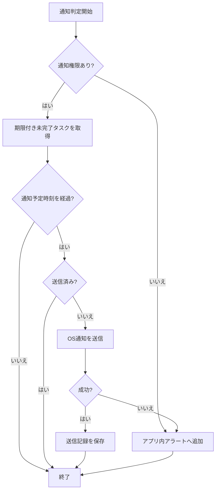

### 5.9 ゴミ箱

- タスクとメモの削除は`deleted_at`を設定する論理削除とする。
- ゴミ箱では種別、タイトル、削除日時、完全削除予定日を表示する。
- 個別復元、個別完全削除、ゴミ箱を空にする操作を提供する。
- 完全削除は確認ダイアログを必須とし、取り消せないことを明示する。
- 起動時に削除日時から30日を超えたレコードを関連画像等とともに完全削除する。

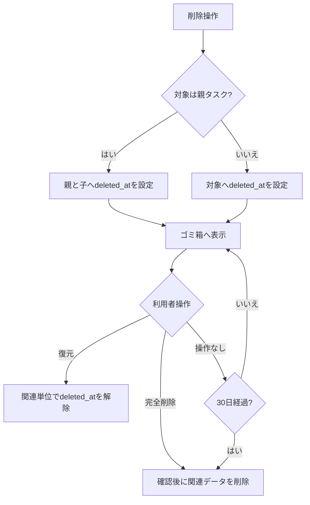

### 5.10 バックアップと復元

- JSONには形式名、スキーマバージョン、生成日時、全テーブルデータ、画像バイナリのBase64を含める。
- エクスポートは一貫したスナップショットから生成する。
- インポート前にJSON構文、形式名、対応バージョン、必須列、型、参照整合性、画像サイズを検証する。
- 復元方式は全置換または統合を選択する。
- 全置換は確認後、1トランザクションで既存データを置換する。
- 統合はID単位で比較し、`updated_at`が新しいレコードを採用する。同時刻は端末側を保持する。
- 中間テーブルと画像も同じ競合結果に従う。
- 復元に失敗した場合は全変更をロールバックし、既存データを保持する。
- 将来バージョンのバックアップは読み込まず、対応外として通知する。

## 6. 画面設計

### 6.1 共通レイアウト

- `UApp`の内側に`UDashboardGroup`、`UDashboardSidebar`、`UDashboardPanel`を配置する。
- PCは折りたたみ可能な左ナビゲーション、モバイルはドロワーナビゲーションとする。
- ナビゲーションはタスク、メモ、カレンダー、タグ、ゴミ箱、設定で構成する。
- 保存成功等の一時通知はToast、容量不足等の継続対応が必要な警告はAlert、破壊的確認はModalを使用する。
- すべての入力にラベル、説明、検証エラーを関連付ける。
- Tailwindの固定パレット色ではなく`text-default`、`bg-elevated`、`border-muted`等を使用する。
- 日本語ロケールを`UApp`へ設定し、`html lang="ja"`を指定する。

### 6.2 画面一覧

| ID     | 画面       | 主な機能                                         |
| ------ | ---------- | ------------------------------------------------ |
| SCR-01 | 初期化     | DB初期化、マイグレーション、障害復旧             |
| SCR-02 | タスク     | 一覧・カンバン切替、検索、絞り込み、作成         |
| SCR-03 | タスク詳細 | 編集、親子、繰り返し、通知、画像、削除           |
| SCR-04 | メモ       | 一覧、検索、ピン留め、作成                       |
| SCR-05 | メモ編集   | Markdown編集・プレビュー、タグ、画像、関連タスク |
| SCR-06 | カレンダー | 月間表示、日別タスク、日付変更                   |
| SCR-07 | 横断検索   | タスク・メモの横断結果                           |
| SCR-08 | タグ       | タグ作成・編集・削除、利用件数                   |
| SCR-09 | ゴミ箱     | 復元、完全削除、自動削除予定                     |
| SCR-10 | 設定       | テーマ、通知、バックアップ、ストレージ情報       |

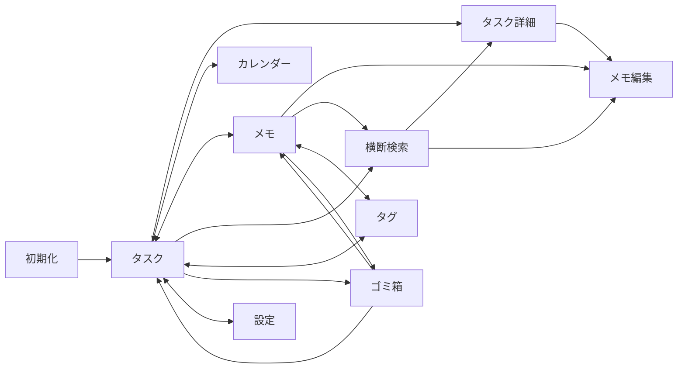

## 7. データ設計

### 7.1 共通方針

- 主キーはクライアントで生成するUUIDとする。
- 日時はISO 8601相当の値として保存する。
- 更新可能レコードは`created_at`と`updated_at`を持つ。
- 論理削除対象は`deleted_at`を持つ。
- 外部キー制約を有効化し、中間テーブルは複合主キーを使用する。
- DB操作はRepository層に閉じ込め、VueコンポーネントからSQLを直接実行しない。

### 7.2 テーブル

| テーブル            | 主な列                                                                                                                                                                                                                         |
| ------------------- | ------------------------------------------------------------------------------------------------------------------------------------------------------------------------------------------------------------------------------ |
| `tasks`             | `id`, `series_id`, `parent_id`, `title`, `description`, `status`, `priority`, `start_at`, `due_at`, `estimated_minutes`, `actual_minutes`, `completed_at`, `scheduled_occurrence_at`, `created_at`, `updated_at`, `deleted_at` |
| `memos`             | `id`, `related_task_id`, `title`, `body`, `is_pinned`, `created_at`, `updated_at`, `deleted_at`                                                                                                                                |
| `tags`              | `id`, `name`, `normalized_name`, `color`, `created_at`, `updated_at`                                                                                                                                                           |
| `task_tags`         | `task_id`, `tag_id`                                                                                                                                                                                                            |
| `memo_tags`         | `memo_id`, `tag_id`                                                                                                                                                                                                            |
| `attachments`       | `id`, `owner_type`, `task_id`, `memo_id`, `file_name`, `mime_type`, `byte_size`, `width`, `height`, `sort_order`, `data`, `created_at`                                                                                         |
| `reminders`         | `id`, `task_id`, `offset_minutes`, `target_due_at`, `notified_at`, `created_at`                                                                                                                                                |
| `recurrence_rules`  | `id`, `task_id`, `frequency`, `interval`, `weekdays`, `month_day`, `use_month_end`, `year_month`, `year_day`, `created_at`, `updated_at`                                                                                       |
| `settings`          | `key`, `value`, `updated_at`                                                                                                                                                                                                   |
| `schema_migrations` | `version`, `name`, `checksum`, `applied_at`                                                                                                                                                                                    |

### 7.3 ER図

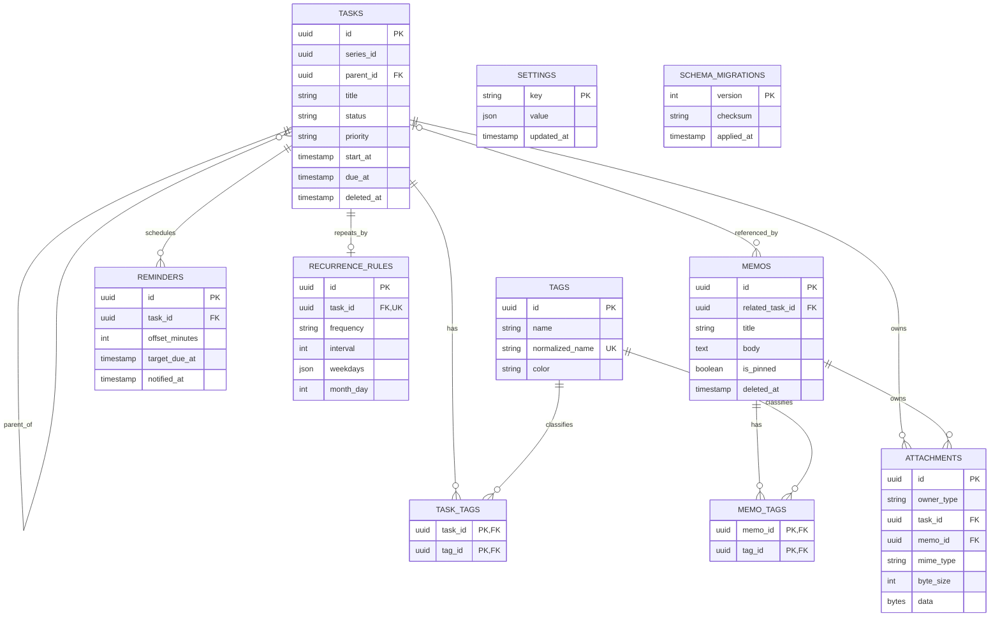

`attachments`は`owner_type`に応じて`task_id`または`memo_id`のどちらか一方だけを必須とするCHECK制約を持つ。

### 7.4 索引

- `tasks(status, deleted_at, updated_at DESC, id DESC)`
- `tasks(due_at, deleted_at, id)`
- `tasks(start_at, deleted_at, id)`
- `tasks(parent_id, deleted_at)`
- `tasks(series_id, scheduled_occurrence_at)`の一意索引
- `memos(is_pinned DESC, updated_at DESC, id DESC)`
- `memos(related_task_id, deleted_at)`
- `tags(normalized_name)`の一意索引
- `task_tags(tag_id, task_id)`、`memo_tags(tag_id, memo_id)`
- `reminders(target_due_at, notified_at)`
- タイトル・本文検索は初期版では正規化列と部分一致を使用し、実測で不足する場合のみPGlite対応全文検索へ移行する。

## 8. 処理シーケンス

### 8.1 DB初期化

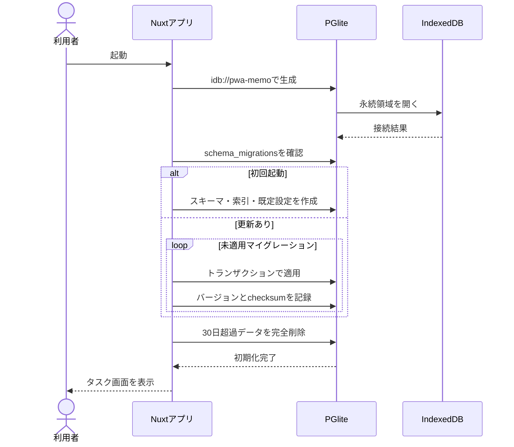

### 8.2 タスク更新

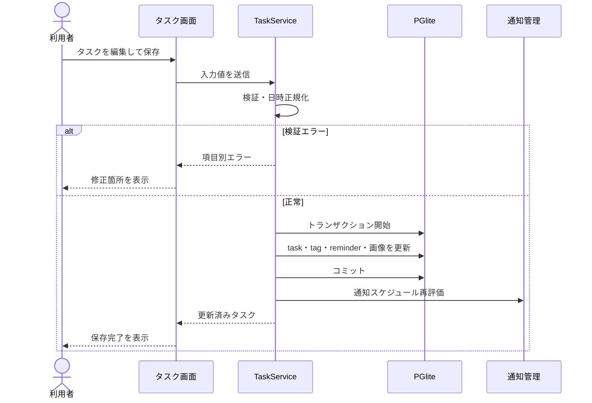

### 8.3 繰り返しタスク生成

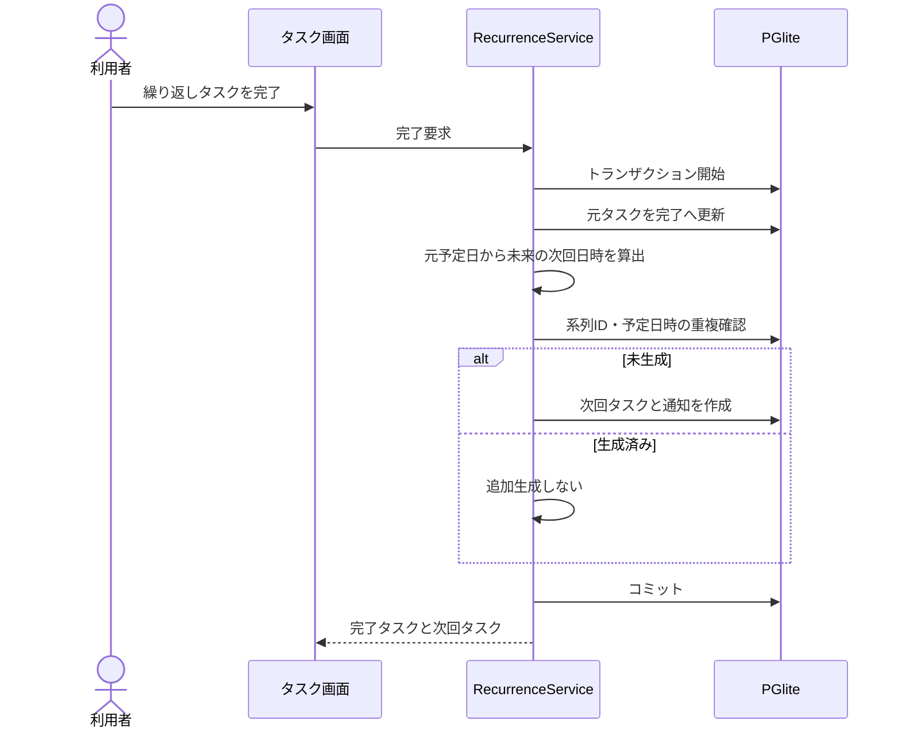

### 8.4 バックアップ復元

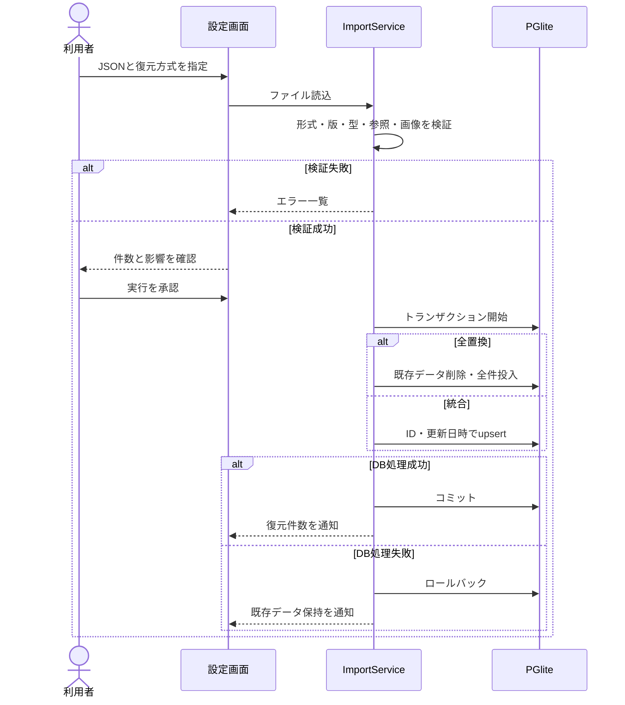

## 9. PWA・オフライン設計

- App Shell、静的JS/CSS、アイコン、PGlite WASMをプリキャッシュする。
- HTMLはNetwork First、ハッシュ付き静的資産はCache Firstとする。
- データ読書きは常にPGliteを使用し、ネットワークへ送信しない。
- 新Service Worker待機時は更新バナーを表示し、利用者の承認後に再読み込みする。
- 未保存の編集がある場合は更新を保留し、保存または破棄を選択させる。
- キャッシュ更新失敗時は現在の稼働版を維持する。

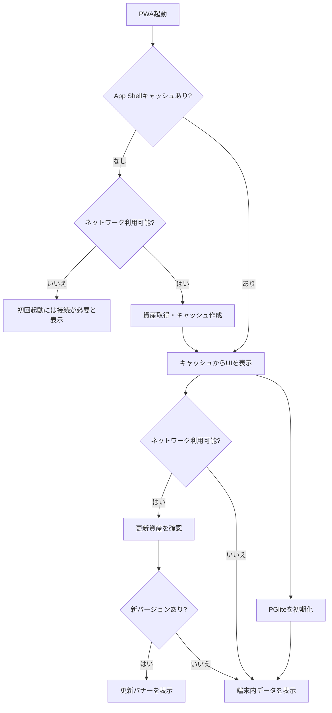

## 10. 非機能要件

### 10.1 性能

- タスク10万件、メモ10万件、タグ1万件を基準データ量とする。
- 一般的なPCの最新Chromeで、DB初期化後の一覧取得、絞り込み、検索、画面切替の95%を1秒以内とする。
- WASM初回取得、初回DB作成、大容量バックアップ、画像変換は上記1秒要件から除外し、進捗を表示する。
- 一覧で全件をメモリまたはDOMへ展開しない。
- クエリ実行計画をテストし、意図した索引が使われることを確認する。

### 10.2 可用性・データ保全

- オフライン状態でも初回導入済みアプリの主要CRUDを利用可能とする。
- DB更新は関連データを含むトランザクションとする。
- ブラウザデータ消去、端末故障、容量制限による喪失は防げないため、JSONバックアップを保全手段とする。
- `navigator.storage.persist()`を要求し、結果と使用量を設定画面に表示する。

### 10.3 セキュリティ・プライバシー

- タスク、メモ、タグ、画像、バックアップ内容をCloudflareまたは分析サービスへ送らない。
- SQLはDrizzleまたはパラメータ化クエリだけを使用する。
- Markdownとファイル名を表示前に安全化する。
- CSPで`default-src 'self'`を基本とし、PGlite WASM、Worker、Web Analyticsに必要な最小限だけを許可する。
- `X-Content-Type-Options: nosniff`、`Referrer-Policy: strict-origin-when-cross-origin`、必要最小限の`Permissions-Policy`を設定する。
- Previewのメール、API Token、Service Tokenはリポジトリ、成果物、ログへ出力しない。

### 10.4 アクセシビリティ

- WCAG 2.2 AAを目標とする。
- すべての操作をキーボードで実行でき、フォーカス位置を視認可能にする。
- ドラッグ操作にはボタンまたはメニューによる代替操作を提供する。
- 色だけで状態・優先度を表現しない。
- 入力エラーは項目と関連付け、スクリーンリーダーへ通知する。

## 11. Cloudflareインフラ設計

### 11.1 構成

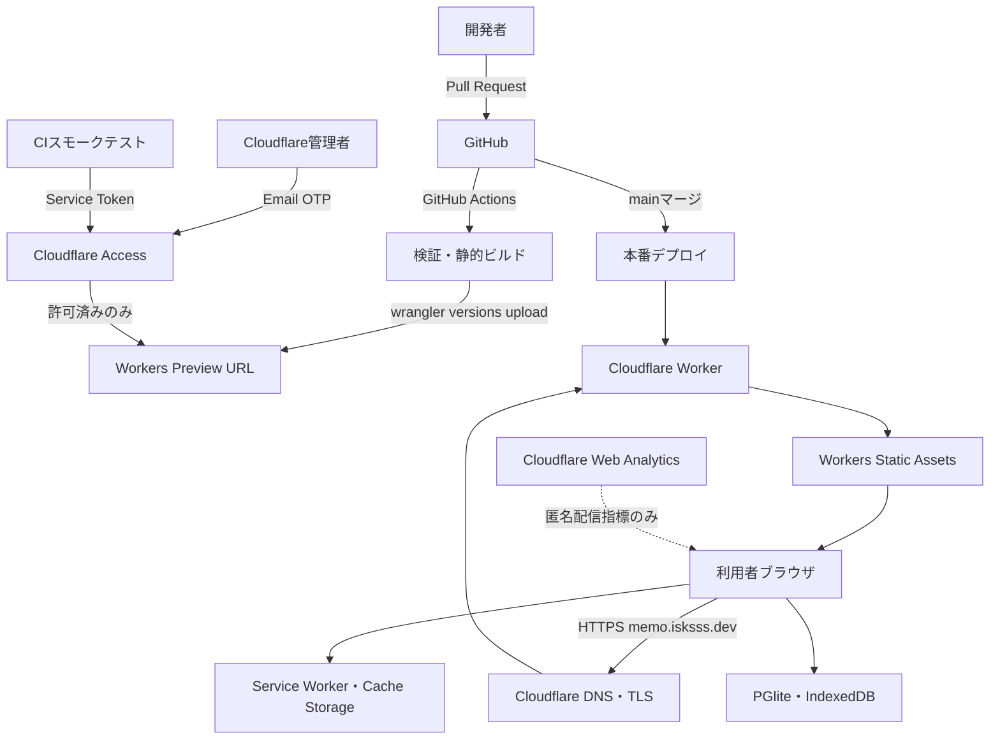

### 11.2 Workers設定

- `wrangler.jsonc`をインフラ設定の正本とする。
- Worker名は`pwa-memo`とする。
- `compatibility_date`は初回実装時の日付を設定し、更新は検証を伴う変更として扱う。
- `assets.directory`にNuxt静的成果物を指定する。
- SPAルートは存在しない静的パスを`index.html`へフォールバックする。
- `preview_urls`を有効化する。
- 本番ルートは`memo.isksss.dev`、`custom_domain: true`とする。
- D1、KV、R2、Durable Objects等のデータBindingは定義しない。
- Workers Logsを有効化し、本文やAuthorizationヘッダーを記録しない。

### 11.3 ドメイン切替

1. 現行`memo.isksss.dev`のDNS、ルート、証明書、配信内容を記録する。
2. Previewで受入試験を完了する。
3. 既存の同名DNSレコードまたはWorker Routeを解除する。
4. WorkerへCustom Domain `memo.isksss.dev`を設定する。
5. CloudflareによるDNS作成とTLS証明書発行を確認する。
6. HTTPS、主要ルート、PWAインストール、オフライン再起動を確認する。
7. 問題時は直前Workerバージョンへロールバックする。

### 11.4 キャッシュ

| 対象                    | 方針                                     |
| ----------------------- | ---------------------------------------- |
| ハッシュ付きJS/CSS/WASM | `public, max-age=31536000, immutable`    |
| `index.html`            | `no-cache`                               |
| Service Worker          | `no-cache`                               |
| Web App Manifest        | `no-cache`                               |
| アイコン                | 内容ハッシュを付ける場合は長期キャッシュ |

### 11.5 Cloudflare Access

- Access Application種別はSelf-hosted Applicationとし、WorkerのPreview deployments onlyを保護する。
- 本番Custom DomainはAccess Applicationの対象に含めず、一般公開する。
- Previewは未認証状態で公開せず、明示的なAllowまたはService Authだけを許可する。
- 人間向けAllowはCloudflare管理者1名のメールアドレス完全一致とする。
- 認証方式はEmail One-time PIN、セッション有効期間は24時間とする。
- 許可メールの追加はCloudflare管理者の手動承認とする。
- CI用には当該Access Applicationだけを対象とするService TokenとService Authポリシーを使用する。
- CI用Client ID/SecretはGitHub Environment Secretsへ保存する。
- Previewを配信するWorkerは`Cf-Access-Jwt-Assertion`の署名、Issuer、Audience、有効期限を検証し、不正時は403を返す。
- Previewレスポンスへ`X-Robots-Tag: noindex, nofollow`を付与する。
- 本番ホストではAccess JWTを要求せず、Preview用認証情報を受け入れ条件にしない。

### 11.6 Access認証シーケンス

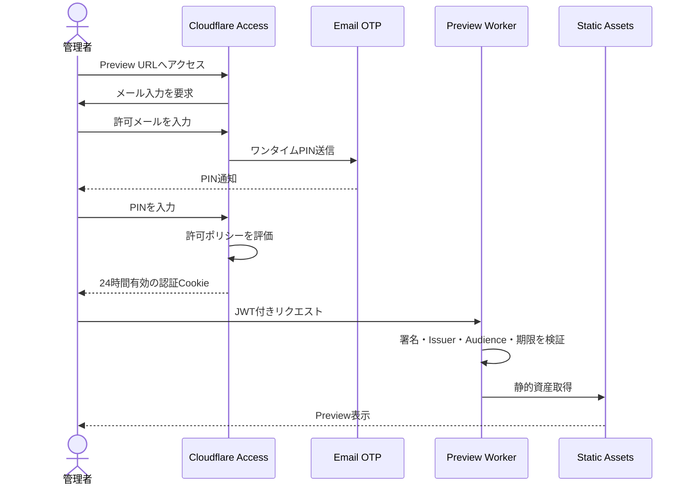

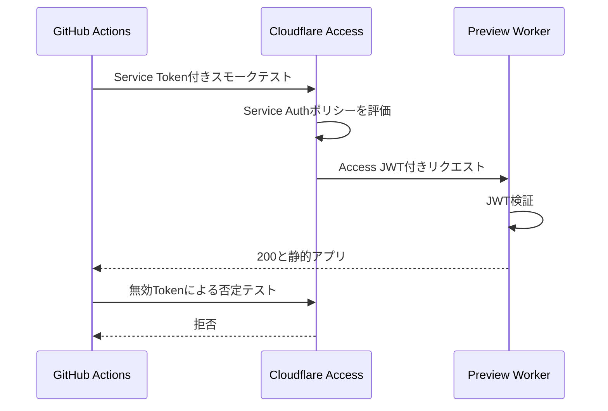

### 11.7 監視

- Workers Logsで配信エラー率、ステータス、実行例外を確認する。
- Cloudflare Web Analyticsでページ表示、Core Web Vitals、地域別配信状況を確認する。
- Web Analyticsへタスク名、メモ内容、検索語、画像、DB情報を送らない。
- Preview URLは現在ログ取得に制約があるため、CIスモークテスト結果を主要な確認手段とする。
- デプロイ後スモークテスト失敗時はジョブを失敗させ、担当者へ通知する。

## 12. CI/CD設計

### 12.1 必要なGitHub Secrets

| Secret                    | 用途                                         |
| ------------------------- | -------------------------------------------- |
| `CLOUDFLARE_API_TOKEN`    | Workerバージョンのアップロード・本番デプロイ |
| `CLOUDFLARE_ACCOUNT_ID`   | Cloudflareアカウント識別                     |
| `CF_ACCESS_CLIENT_ID`     | Previewスモークテスト                        |
| `CF_ACCESS_CLIENT_SECRET` | Previewスモークテスト                        |

API Tokenは対象アカウント・対象Workerに必要な最小権限だけを付与する。Secret値はPR由来コードから参照できないよう、GitHub Environmentとfork PR制限を使用する。

### 12.2 PRフロー

1. `pnpm install --frozen-lockfile`
2. 型検査
3. Lint
4. 単体・コンポーネントテスト
5. 静的ビルド
6. Wrangler dry-run
7. `wrangler versions upload --preview-alias pr-<番号>`
8. Access Service Tokenを用いたスモークテスト
9. Preview URLをPRへ通知

forkからのPRはSecretを使用するPreviewデプロイを実行せず、検証とビルドまでとする。

### 12.3 本番フロー

1. `main`へのマージをトリガーとする。
2. PRと同一の検証・ビルドを再実行する。
3. GitHub Production Environmentを通して本番へデプロイする。
4. `https://memo.isksss.dev`へ認証なしでスモークテストする。
5. 失敗時は新バージョンを正常扱いせず、直前の正常バージョンへロールバックする。

## 13. テスト・受入基準

### 13.1 機能

- タスク・親子タスク・メモ・タグ・画像の作成、参照、更新、削除、復元が仕様どおり動作する。
- 5状態カンバン、一覧、カレンダーで同じDB状態が反映される。
- 繰り返し完了時に未来の次回タスクが1件だけ生成される。
- 複数通知が重複せず、権限拒否時にアプリ内通知へ縮退する。
- Markdownからスクリプトを実行できない。
- ゴミ箱データが30日後に関連データとともに完全削除される。

### 13.2 バックアップ

- 画像を含む全件をエクスポートし、全置換で同一状態へ復元できる。
- 統合時は新しい`updated_at`が採用され、同時刻は端末側が残る。
- 不正JSON、将来バージョン、参照不整合、過大画像を拒否する。
- 復元途中の失敗時に既存DBが変化しない。

### 13.3 PWA・互換性

- PC・Androidの最新Chrome/Edgeでインストールできる。
- 一度オンライン起動した後、オフラインで再起動と主要CRUDができる。
- 新版検出時に更新バナーが表示され、未保存内容を失わない。
- ブラウザAPI非対応時は明確な縮退表示を行う。

### 13.4 性能

- タスク10万件、メモ10万件で主要操作の95%が1秒以内で完了する。
- 一覧・検索で全レコードをDOMへ生成しない。
- DBクエリが定義済み索引を利用する。
- 画像変換、バックアップ、初回WASM取得中に進捗とキャンセル可否を表示する。

### 13.5 Cloudflare・Access

- `memo.isksss.dev`が有効なTLS証明書で配信される。
- SPAの各URLへ直接アクセスしてもアプリが表示される。
- 未認証、未許可メール、期限切れCookie、不正JWT、無効Service TokenはPreviewへアクセスできない。
- 管理者メール＋OTPと有効Service TokenだけがPreviewへアクセスできる。
- Previewに`X-Robots-Tag: noindex, nofollow`が付与される。
- 本番はAccessログインを要求せず、Previewポリシーの影響を受けない。
- CI失敗時に本番が更新されず、直前バージョンへロールバックできる。
- キャッシュヘッダーが資産種別ごとの方針と一致する。

## 14. 運用

- Cloudflare API TokenとAccess Service Tokenは最小権限とし、定期的にローテーションする。
- 管理者メール変更時はAccess Allowポリシーを更新し、旧メールを削除する。
- 依存関係、Wrangler、`compatibility_date`の更新はPreviewでPWA、PGlite、Accessを再検証してから本番反映する。
- 障害時はWorkers Logs、GitHub Actions、Cloudflareデプロイ履歴の順に確認する。
- データ障害は利用者のJSONバックアップから復元する。Cloudflare側に利用者データの復元元は存在しない。

## 15. 制約と注意事項

- IndexedDBの容量はブラウザ、端末、空きディスクに依存する。10万件すべてに上限枚数の画像を保存できることは保証しない。
- ブラウザデータ消去、アプリのストレージ削除、端末故障ではデータを失う可能性がある。
- Periodic Background Syncは実験的機能であり、PWA終了中の通知時刻を保証しない。
- Preview URLはCloudflare Accessで保護するが、アプリ本体の認証機能ではない。
- Cloudflareはアプリ資産と匿名配信指標のみを扱い、利用者データの保管主体ではない。
